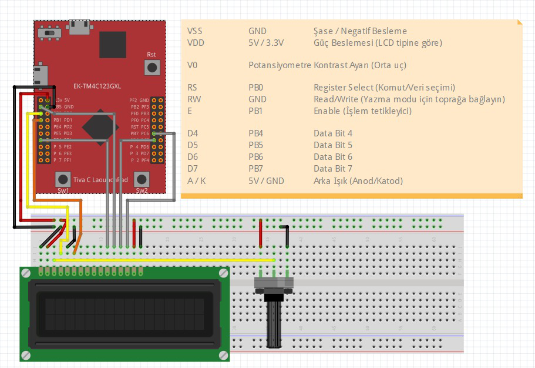

# Ödev 1 – 16x2 LCD Sürücü

Bu ödevde Tiva TM4C123GH6PM mikrodenetleyicisi kullanılarak
16x2 karakter LCD sürücü kütüphanesi yazılmıştır.

## İçerik
- main.c
- lcd.c / lcd.h
- Devre şeması

Not: Tüm fonksiyonlar açıklamalı yorum satırları içermektedir.

## Bağlantı Şeması

